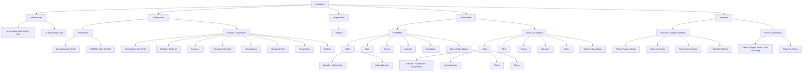
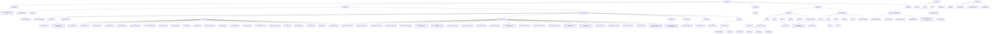
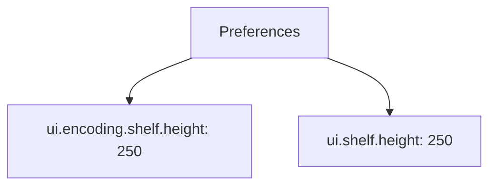
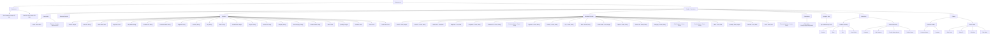
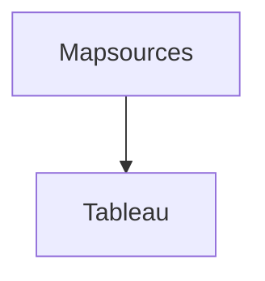
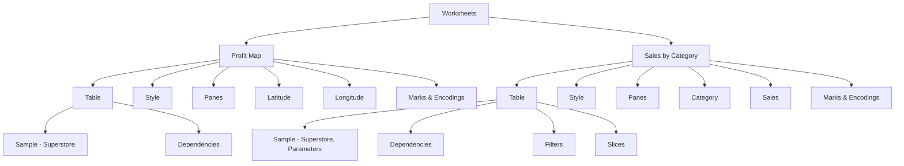
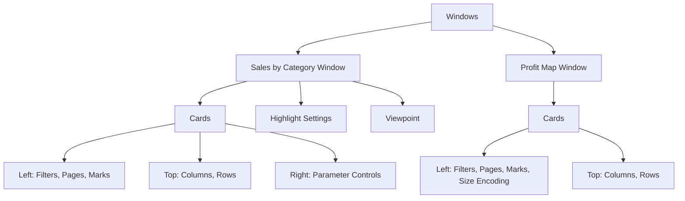

# Prompt:
 
This is a XML file corresponding to a Tableau report. Can you explain to me different constructs within this XML file? Also, create a diagram in Markdown with mermaid to explain the report structure and its components.
 
---
---
 
# Response:

## **1. Overview of the XML Structure**

The XML file represents a Tableau workbook, detailing data sources, worksheets, maps, styles, and window configurations. Here's a high-level breakdown of its main sections:

- **`<workbook>`**: The root element containing all configurations for the Tableau workbook.
- **`<preferences>`**: UI preferences and settings.
- **`<datasources>`**: Definitions of data sources used in the workbook, including connections, columns, and metadata.
- **`<mapsources>`**: Configuration for map-related settings.
- **`<worksheets>`**: Definitions of individual worksheets (views) within the workbook.
- **`<windows>`**: Layout and display settings for the worksheets.

## **2. Detailed Breakdown of Constructs**

### **a. Workbook Root Element**

- **`source-platform`**: Indicates the platform on which the workbook was created (`mac` in this case).
- **`version`**: The version of Tableau used (`9.0`).

```xml
<workbook source-platform='mac' version='9.0' xmlns:user='https://nam04.safelinks.protection.outlook.com/?url=http%3A%2F%2Fwww.tableausoftware.com%2Fxml%2Fuser&data=05%7C02%7CRaghu.Pushpakath%40netapp.com%7C1de7454d81d340edfde908dd393b69b9%7C4b0911a0929b4715944bc03745165b3a%7C0%7C0%7C638729649550585530%7CUnknown%7CTWFpbGZsb3d8eyJFbXB0eU1hcGkiOnRydWUsIlYiOiIwLjAuMDAwMCIsIlAiOiJXaW4zMiIsIkFOIjoiTWFpbCIsIldUIjoyfQ%3D%3D%7C0%7C%7C%7C&sdata=BzcPqaAL7%2BpEMSAaYsgKZhzICfWUkPArcsPW7FVGheM%3D&reserved=0'>
```

### **b. Preferences**

Defines UI-related settings such as shelf heights.

```xml
<preferences>
  <preference name='ui.encoding.shelf.height' value='250' />
  <preference name='ui.shelf.height' value='250' />
</preferences>
```

### **c. Datasources**

#### **i. Parameters**

Parameters are treated as a special data source. They allow dynamic input values that can be used in calculations or filters.

```xml
<datasource hasconnection='false' inline='true' name='Parameters' version='9.0'>
  <!-- Parameter Definitions -->
</datasource>
```

**Parameters Defined:**
- **`Top Customers`**: An integer parameter with a default value of 5 and a range from 5 to 20.
- **`Profit Bin Size`**: An integer parameter with a default value of 200 and a range from 50 to 200.

#### **ii. Sample - Superstore**

This is the primary data source, typically containing sales data.

```xml
<datasource inline='true' name='Sample - Superstore' version='9.0'>
  <!-- Connection Details -->
  <!-- Relation Definitions -->
  <!-- Column Definitions -->
  <!-- Metadata Records -->
</datasource>
```

**Key Components:**

- **Connection**: Defines how Tableau connects to the data (e.g., Excel file location).

- **Relation**: Represents tables within the data source. For example, the `Orders$` table.

- **Columns**: Defines each column's datatype, name, role (dimension or measure), and other properties.

- **Metadata Records**: Provides additional information about each column, such as aggregation type, data type, and attributes.

**Example Column Definition:**

```xml
<column datatype='string' name='[Product Name]' role='dimension' type='nominal'>
</column>
```

### **d. Mapsources**

Defines map-related settings used in worksheets that involve geographical data.

```xml
<mapsources>
  <mapsource name='Tableau' />
</mapsources>
```

### **e. Worksheets**

Each worksheet represents a separate view or analysis within the workbook.

#### **i. Profit Map**

A map visualization showing profit distribution.

```xml
<worksheet name='Profit Map'>
  <!-- Table Definition -->
  <!-- Style Settings -->
  <!-- Panes and Marks -->
  <!-- Rows and Columns -->
</worksheet>
```

**Components:**

- **Table**: Defines the data, including datasources and dependencies.

- **Style**: Customizes the appearance of the map layers and map itself.

- **Encodings**: Determines how data fields are visually represented (e.g., size based on profit).

- **Rows & Columns**: Geographical coordinates (`Latitude` and `Longitude`).

#### **ii. Sales by Category**

A bar chart showing sales aggregated by category.

```xml
<worksheet name='Sales by Category'>
  <!-- Table Definition -->
  <!-- Style Settings -->
  <!-- Panes and Marks -->
  <!-- Rows and Columns -->
</worksheet>
```

**Components:**

- **Filters**: Applies filters based on parameters and dimensions.

- **Slices**: Defines how data is sliced across different dimensions.

- **Rows & Columns**: Categories on rows and aggregated sales on columns.

### **f. Windows**

Defines how worksheets are displayed, including layout arrangements and UI components like filters and parameters.

#### **i. Sales by Category Window**

```xml
<window auto-hidden='0' class='worksheet' maximized='0' name='Sales by Category'>
  <!-- Cards Configuration -->
  <!-- Highlight Settings -->
  <!-- Viewpoint -->
</window>
```

**Components:**

- **Cards**: Defines what UI elements (like filters or parameters) appear on different edges of the window.

- **Highlight**: Settings to highlight specific data points based on criteria.

#### **ii. Profit Map Window**

```xml
<window auto-hidden='0' class='worksheet' maximized='1' name='Profit Map'>
  <!-- Cards Configuration -->
</window>
```

**Components:**

- **Cards**: Similar to the Sales window but tailored for the Profit Map, including size encodings.

## **3. Mermaid Diagram of the Report Structure**

Below is a Mermaid diagram that visualizes the hierarchical structure of the Tableau report based on the XML file provided.




**Explanation of the Diagram:**

- **Workbook**: The central node representing the entire Tableau workbook.
 
- **Preferences**:
  - **ui.encoding.shelf.height** and **ui.shelf.height**: UI configurations for shelf heights.

- **Datasources**:
  - **Parameters**: Contains dynamic input parameters like "Top Customers" and "Profit Bin Size".
  - **Sample - Superstore**: The primary data source with connections, relations, columns, metadata, calculations, groups, hierarchies, and folders.

- **Mapsources**:
  - **Tableau**: Indicates the default map source used.

- **Worksheets**:
  - **Profit Map**: A map visualization showing profit across different regions.
  - **Sales by Category**: A bar chart illustrating sales distribution across categories.

- **Windows**:
  - **Sales by Category Window**: Configures UI elements like filters on the left, column/row selectors on top, and parameter controls on the right.
  - **Profit Map Window**: Configures UI elements including size encodings and filters.

This diagram provides a hierarchical view of the workbook's structure, illustrating how data sources feed into worksheets, which are then arranged and styled within windows.

## **4. Additional Notes**

- **Calculations**: Defined within data sources, allowing for computed fields like `Profit Ratio`.

- **Groups and Sets**: Enable categorization and segmentation of data, such as grouping top customers by profit.

- **Hierarchies and Folders**: Organize dimensions and measures for easier navigation and analysis within Tableau's UI.

- **Style Rules**: Customize the appearance of visual elements, especially in map worksheets (e.g., toggling visibility of certain map layers).

- **Encodings**: Define how data is visually represented, such as sizing marks based on profit values in the Profit Map.

Understanding these constructs is crucial for effectively migrating or customizing Tableau reports, ensuring that all visualizations and data manipulations are accurately replicated in the target platform (e.g., Power BI).

===========
# Prompt:
Can you recreate the mermaid diagram so that the diagram is vertically aligned rather than horizondal?

# Response:

Certainly! Below is the updated Mermaid diagram with a **vertical alignment**, enhancing clarity and emphasizing the hierarchical structure of the Tableau report.



### **Explanation of the Vertically Aligned Diagram**

- **Workbook**: The central node representing the entire Tableau workbook.

- **Preferences**:
  - **ui.encoding.shelf.height**: UI setting for encoding shelf height.
  - **ui.shelf.height**: UI setting for shelf height.

- **Datasources**:
  - **Parameters**:
    - **Top Customers**: An integer parameter with a default value of 5 and a range from 5 to 20.
    - **Profit Bin Size**: An integer parameter with a default value of 200 and a range from 50 to 200.
  - **Sample - Superstore**:
    - **Connection**: Details about the Excel connection, including connection type and filename.
    - **Relation: Orders$**: Represents the "Orders$" table within the data source.
    - **Columns**: Definitions of each column, specifying datatype, name, role (dimension or measure), and additional attributes.
    - **Metadata Records**: Provides extra information about each column, such as aggregation type and data type.
    - **Calculations**: Contains computed fields like `[Profit Ratio]` which is calculated as `SUM([Profit])/SUM([Sales])`.
    - **Groups & Sets**: Defines groups like `[Top Customers by Profit]` that categorize data based on specific criteria.
    - **Hierarchies**: Establishes hierarchical relationships, such as the `Location Hierarchy` (Country → State → City → Postal Code) and `Product Hierarchy` (Category → Sub-Category → Product Name (group) → Product Name).
    - **Folders**:
      - **Customer Folder**: Organizes dimensions related to customers, like `[Customer Name]` and `[Segment]`.
      - **Order Folder**: Organizes dimensions related to orders, like `[Order Date]`, `[Order ID]`, `[Ship Date]`, and `[Ship Mode]`.

- **Mapsources**:
  - **Tableau Map**: Indicates the default map source used for map visualizations.

- **Worksheets**:
  - **Profit Map**:
    - **Table**: Defines the data used in the Profit Map, referencing the `Sample - Superstore` data source.
    - **Dependencies**: Specifies which columns are used in the view.
    - **Style**: Customizes the appearance of map layers and the map itself.
    - **Panes**: Layout panes for organizing the visualization components.
    - **Latitude & Longitude**: Geographical coordinates used for plotting the map.
    - **Marks & Encodings**: Visual encodings (like size) based on profit values.
 
  - **Sales by Category**:
    - **Table**: Defines the data used in the Sales by Category view, referencing both `Sample - Superstore` and `Parameters` data sources.
    - **Dependencies**: Specifies which columns are used in the view.
    - **Filters**: Applies filters based on groups and sets.
    - **Slices**: Determines data slicing across dimensions.
    - **Style**: Customizes the appearance of the chart.
    - **Panes**: Layout panes for organizing the visualization components.
    - **Category & Sales**: Dimensions and measures used for the bar chart.
    - **Marks & Encodings**: Visual encodings based on sales values.

- **Windows**:
  - **Sales by Category Window**:
    - **Cards**:
      - **Left**: Contains `Filters`, `Pages`, and `Marks` cards.
      - **Top**: Contains `Columns` and `Rows` cards.
      - **Right**: Contains `Parameter Controls`.
    - **Highlight Settings**: Configurations to highlight specific data points based on criteria.
 
  - **Profit Map Window**:
    - **Cards**:
      - **Left**: Contains `Filters`, `Pages`, `Marks`, and `Size Encoding` cards.
      - **Top**: Contains `Columns` and `Rows` cards.

### **Key Enhancements in the Vertical Diagram**

- **Hierarchical Clarity**: The vertical alignment emphasizes parent-child relationships, making it easier to follow the structure from top (Workbook) to bottom (Detailed Components).

- **Sectional Separation**: Each main section (`Preferences`, `Datasources`, `Mapsources`, `Worksheets`, `Windows`) is clearly separated and expanded with their respective sub-components.

- **Detailed Component Breakdown**: Within each subsection, individual elements like `Connection`, `Columns`, `Groups`, etc., are further broken down to show their internal structure and relationships.

- **Improved Readability**: The vertical flow ensures that related components are stacked logically, enhancing the overall readability and comprehension of the report's architecture.

This vertically aligned diagram provides a structured and clear visualization of the Tableau report's components, facilitating easier understanding and navigation through its various elements.

---

If you have any further adjustments or need additional details, feel free to ask!

==============

# Prompt:
Can you also generate mermaid diagrams for these individual components:
Workbook --> Preferences["Preferences"]
Workbook --> Datasources["Datasources"]
Workbook --> Mapsources["Mapsources"]
Workbook --> Worksheets["Worksheets"]
Workbook --> Windows["Windows"]

# Response:
Certainly! Below are individual Mermaid diagrams for each of the main components within the Tableau workbook XML file: **Preferences**, **Datasources**, **Mapsources**, **Worksheets**, and **Windows**. Each diagram is accompanied by a brief explanation to provide context and clarity.

---

## **1. Preferences**

### **Explanation**

The `<preferences>` section defines UI-related settings that customize the appearance and behavior of shelves within Tableau. In this XML, there are two preferences:

- **ui.encoding.shelf.height**: Sets the height of the encoding shelf.
- **ui.shelf.height**: Sets the height of the general shelf.

### **Mermaid Diagram**



---

## **2. Datasources**

### **Explanation**

The `<datasources>` section comprises two primary data sources:

1. **Parameters**: Contains user-defined parameters that allow dynamic input values within the report.
2. **Sample - Superstore**: Represents the main data source, typically containing sales data, connections, relations, columns, metadata, calculations, groups, hierarchies, and folders.

### **Mermaid Diagram**



---

## **3. Mapsources**

### **Explanation**

The `<mapsources>` section defines map-related configurations used within the workbook. In this XML, there's a single map source named **Tableau**, which likely employs Tableau's default mapping capabilities.

### **Mermaid Diagram**



---

## **4. Worksheets**

### **Explanation**

The `<worksheets>` section contains individual worksheets (views) within the Tableau workbook. In this XML, there are two worksheets:

1. **Profit Map**: A geographical map visualization displaying profit distribution.
2. **Sales by Category**: A bar chart illustrating sales aggregated by different categories.

### **Mermaid Diagram**



---

## **5. Windows**

### **Explanation**

The `<windows>` section manages the layout, display settings, and UI components of each worksheet within the Tableau workbook. Each window corresponds to a worksheet and defines:

- **Cards**: UI elements like filters, parameters, marks, columns, and rows positioned on different edges (left, top, right).
- **Highlight Settings**: Configurations for data point highlighting based on specific criteria.
- **Viewpoint**: Represents the current view state (e.g., zoom level, pan position), though it's empty in this XML.

In this XML, there are two windows corresponding to the two worksheets:

1. **Sales by Category Window**
2. **Profit Map Window**

### **Mermaid Diagram**



---

## **Summary**

These individual diagrams provide a detailed visualization of each main component within the Tableau workbook XML file. Understanding these structures is crucial for tasks such as migration to other platforms (e.g., Power BI), customizing reports, or troubleshooting issues within Tableau.

- **Preferences**: UI settings customizing shelf heights.
- **Datasources**: Definitions of data sources, including parameters and the main `Sample - Superstore` datasource with its detailed configurations.
- **Mapsources**: Configuration for map-related settings.
- **Worksheets**: Individual views (`Profit Map` and `Sales by Category`) with their respective data tables, dependencies, styles, and encodings.
- **Windows**: Layout and UI configurations for each worksheet, detailing how filters, parameters, and other controls are positioned.

If you need further breakdowns of sub-components or additional diagrams, feel free to ask!