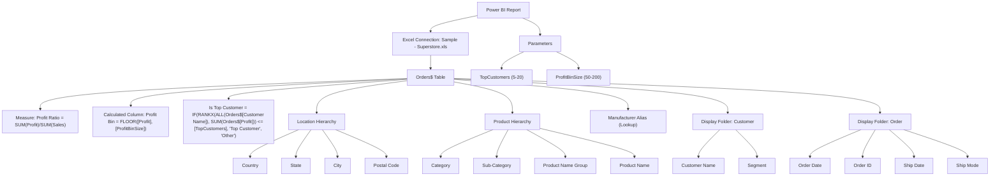

# Prompt:

Excellent. Can you now try converting the "Datasources" part so that I can use it for a Power BI report?

---
---


Certainly! Converting Tableau's `<Datasources>` section to Power BI involves mapping Tableau-specific constructs to their Power BI equivalents. This process includes establishing data connections, defining parameters, creating calculated fields, setting up hierarchies, and organizing data for optimal reporting.

Below is a comprehensive guide to help you recreate the "Datasources" part of your Tableau report in Power BI.

## **1. Overview**

### **Tableau vs. Power BI Constructs**

| **Tableau**                                   | **Power BI**                                     |
|-----------------------------------------------|--------------------------------------------------|
| `<datasource>`                                | **Data Source** in Power BI (via Power Query)    |
| **Parameters**                                | **Parameters** in Power Query or **Slicers**     |
| **Calculated Columns and Measures**           | **Calculated Columns** and **Measures** in DAX    |
| **Groups/Sets**                               | **Groups** and **Calculations** in Power BI      |
| **Hierarchies**                               | **Hierarchies** in the Data Model                 |
| **Folders**                                   | **Display Folders** in the Fields Pane            |
| **Aliases**                                   | **Column Renaming** and **Mapping Tables**       |

---

## **2. Step-by-Step Conversion**

### **A. Connecting to the Excel Data Source**

1. **Import Data from Excel:**
   - Open Power BI Desktop.
   - Click on **`Get Data`** > **`Excel`**.
   - Navigate to the location of `Sample - Superstore.xls` and select it.
   - In the **Navigator** window, select the relevant sheets (e.g., `Orders$`) and click **`Load`**.

2. **Verify Data Types:**
   - After loading, go to **`Transform Data`** to open Power Query Editor.
   - Ensure each column has the correct data type (e.g., Integer, Date, String, Real).
   - Rename columns if necessary to match Tableau’s naming conventions for consistency.

### **B. Defining Parameters**

Tableau's parameters can be replicated in Power BI using **Power Query Parameters** or **DAX Measures** combined with **Slicers** for interactivity.

1. **Create Parameters in Power Query:**
   - In Power Query Editor, go to **`Manage Parameters`** > **`New Parameter`**.
  
   - **Parameter 1: Top Customers**
     - **Name:** `TopCustomers`
     - **Type:** Decimal Number
     - **Default Value:** `5`
     - **Allowed Values:** Any value or specify a range (e.g., 5 to 20).

   - **Parameter 2: Profit Bin Size**
     - **Name:** `ProfitBinSize`
     - **Type:** Decimal Number
     - **Default Value:** `200`
     - **Allowed Values:** Any value or specify a range (e.g., 50 to 200).

2. **Using Parameters in Queries:**
   - These parameters can be used to dynamically filter data or create bins based on user input.

### **C. Creating Calculated Columns and Measures**

1. **Calculated Column: Profit Ratio**
   - In Power BI, go to the **`Data`** view.
   - Select the `Orders$` table.
   - Click on **`New Column`** and enter the following DAX formula:

     ```DAX
     Profit Ratio = DIVIDE(SUM(Orders$[Profit]), SUM(Orders$[Sales]))
     ```

   - **Note:** Power BI handles aggregations differently. If you intend `Profit Ratio` to be dynamic based on the context of your visuals, consider creating it as a **Measure** instead:

     ```DAX
     Profit Ratio = DIVIDE(SUM(Orders$[Profit]), SUM(Orders$[Sales]))
     ```

2. **Calculated Columns for Binning: Profit (bin)**
   - To create bins similar to Tableau, use **Calculated Columns** or **Power BI’s Binning feature**:
  
     - **Using Calculated Column:**
    
       ```DAX
       Profit Bin =
       VAR BinSize = [ProfitBinSize]  -- Reference to the ProfitBinSize parameter
       RETURN
       FLOOR(Orders$[Profit], BinSize)
       ```
    
     - **Using Power BI’s Binning:**
       - Select the `Profit` column.
       - Go to **`Modeling`** > **`New Group`**.
       - Set the **Bin size** to `200` (or link it dynamically using parameters with advanced techniques).

### **D. Establishing Groups/Sets**

**Top Customers by Profit:**

To replicate Tableau's "Top Customers by Profit" group:

1. **Create a Measure for Total Profit:**
  
   ```DAX
   Total Profit = SUM(Orders$[Profit])
   ```

2. **Create a Measure for Rank:**
  
   ```DAX
   Customer Profit Rank =
   RANKX(
       ALL(Orders$[Customer Name]),
       [Total Profit],
       ,
       DESC,
       Dense
   )
   ```

3. **Filter Top N Customers:**
   - In your visual (e.g., Table or Chart), add a filter on **`Customer Name`** where **`Customer Profit Rank`** is less than or equal to `TopCustomers` (5).

   - Alternatively, create a **Top N filter** directly in the visual’s filter pane:
     - Drag **`Customer Name`** to the **`Filters`** pane.
     - Select **`Top N`**.
     - Enter **`5`** in the **`Show items`** field.
     - Drag **`Total Profit`** to the **`By value`** field.
     - Click **`Apply filter`**.

### **E. Defining Hierarchies**

Hierarchies enable drill-down functionality in your reports.

1. **Location Hierarchy: Country → State → City → Postal Code**
   - In **`Model`** view, select the `Orders$` table.
   - Right-click on **`Country`** > **`New hierarchy`** and name it **`Location Hierarchy`**.
   - Drag **`State`**, **`City`**, and **`Postal Code`** into the **`Location Hierarchy`**.

2. **Product Hierarchy: Category → Sub-Category → Product Name (group) → Product Name**
   - Similarly, create another hierarchy in the `Orders$` table:
     - **`Product Hierarchy`**
       - **`Category`**
       - **`Sub-Category`**
       - **`Product Name (group)`** (Create a calculated column if not present)
       - **`Product Name`**

   - **Creating `Product Name (group)` Calculated Column:**
    
     ```DAX
     Product Name Group =
     SWITCH(TRUE(),
         CONTAINSSTRING(Orders$[Product Name], "While you Were Out"), "Other",
         CONTAINSSTRING(Orders$[Product Name], "3D Systems"), "3D Systems",
         -- Continue mapping based on aliases
         "Others"  -- Default group
     )
     ```
  
   - **Note:** Adjust the `SWITCH` conditions based on your alias mappings in Tableau to ensure proper grouping.

### **F. Organizing Fields into Display Folders**

Power BI allows you to create **Display Folders** to organize fields within the **Fields Pane**.

1. **Creating Display Folders:**
   - In **`Model`** view, select the fields you want to group (e.g., dimensions related to customers).
   - Right-click on the field > **`Display Folder`** > **`New Folder`**.
   - **Customer Folder:**
     - Create a folder named **`Customer`**.
     - Move **`Customer Name`**, **`Segment`**, etc., into this folder.

   - **Order Folder:**
     - Create a folder named **`Order`**.
     - Move **`Order Date`**, **`Order ID`**, **`Ship Date`**, **`Ship Mode`**, etc., into this folder.

2. **Repeat:** Organize other fields as needed for optimal report structure.

### **G. Handling Aliases**

Tableau uses **aliases** to map specific values to more user-friendly or grouped names. In Power BI, this can be achieved through **calculated columns**, **mapping tables**, or **Power Query transformations**.

1. **Using Mapping Tables:**
   - Create a separate table (e.g., `ManufacturerMapping`) with two columns: **`Original`** and **`Alias`**.
  
     | Original                                             | Alias            |
     |------------------------------------------------------|------------------|
     | "While you Were Out" Message Book, One Form per Page  | Other            |
     | "3D Systems Cube Printer, 2nd Generation, Magenta"   | 3D Systems       |
     | "3M Hangers With Command Adhesive"                   | 3M               |
     | ...                                                  | ...              |

   - **Import this table** into Power BI via **`Enter Data`** or load from a source.

2. **Creating a Calculated Column with Lookup:**
  
   ```DAX
   Manufacturer Alias =
   LOOKUPVALUE(
       ManufacturerMapping[Alias],
       ManufacturerMapping[Original],
       Orders$[Product Name],
       "Other"  -- Default value if no match found
   )
   ```

3. **Using the Alias in Visuals:**
   - Replace **`Product Name`** with **`Manufacturer Alias`** in your visuals to reflect the grouped names.

### **H. Establishing Relationships (If Applicable)**

If your data model includes multiple tables (e.g., Customers, Products), define **relationships** to enable comprehensive reporting.

1. **Define Relationships:**
   - In **`Model`** view, drag and drop fields to create relationships (e.g., `Customer ID` in `Orders$` to `Customer ID` in `Customers` table).
   - Ensure the cardinality and cross-filter direction match your reporting needs.

---

## **3. Recreating Hierarchical Structures in Power BI**

Hierarchies enhance drill-down capabilities in your reports, allowing users to navigate from high-level summaries to detailed data seamlessly.

1. **Creating a Hierarchy:**
   - In **`Model`** view, right-click on a field (e.g., `Country`).
   - Select **`New hierarchy`** and name it (e.g., `Location Hierarchy`).
   - Drag subsequent fields (`State`, `City`, `Postal Code`) into the hierarchy.

2. **Using Hierarchies:**
   - In your visuals (e.g., Matrix, Charts), add the hierarchy to enable drill-down functionalities.

---

## **4. Example: Translating Specific Constructs**

Let's translate some specific Tableau constructs from the XML to Power BI:

### **A. Calculated Field: Profit Ratio**

**Tableau XML:**

```xml
<column caption='Profit Ratio' datatype='real' default-format='p0%' name='[Calculation_5571209093911105]' role='measure' type='quantitative'>
  <calculation class='tableau' formula='SUM([Profit])/SUM([Sales])' scope-isolation='false' />
</column>
```

**Power BI Equivalent:**

- **Measure Creation:**
 
  ```DAX
  Profit Ratio = DIVIDE(SUM(Orders$[Profit]), SUM(Orders$[Sales]), 0)
  ```

- **Explanation:**
  - `DIVIDE` is used for safe division to handle cases where `Sales` might be zero.
  - The third parameter (`0`) specifies the result when division by zero occurs.

### **B. Group: Top Customers by Profit**

**Tableau XML:**

```xml
<group name='[Top Customers by Profit]' name-style='unqualified' user:ui-builder='filter-group'>
  <groupfilter count='[Parameters].[Parameter 1]' end='top' function='end' units='records' user:ui-marker='end' user:ui-top-by-field='true'>
    <groupfilter direction='DESC' expression='SUM([Profit])' function='order' user:ui-marker='order'>
      <groupfilter function='level-members' level='[Customer Name]' user:ui-enumeration='all' user:ui-marker='enumerate' />
    </groupfilter>
  </groupfilter>
</group>
```

**Power BI Equivalent:**

- **Creating a Measure for Top N Customers:**
 
  ```DAX
  Is Top Customer =
  IF(
      RANKX(
          ALL(Orders$[Customer Name]),
          CALCULATE(SUM(Orders$[Profit]))
      ) <= [TopCustomers],
      "Top Customer",
      "Other"
  )
  ```

- **Using the Measure in Visuals:**
  - Add **`Is Top Customer`** as a filter in your visuals to display only "Top Customer" or "Other".
 
  - Alternatively, use **`Top N`** filters directly in visuals as described earlier.

### **C. Hierarchies: Location and Product**

**Tableau XML:**

```xml
<drill-paths>
  <drill-path name='Location'>
    <field>[Country]</field>
    <field>[State]</field>
    <field>[City]</field>
    <field>[Postal Code]</field>
  </drill-path>
  <drill-path name='Product'>
    <field>[Category]</field>
    <field>[Sub-Category]</field>
    <field>[Product Name (group)]</field>
    <field>[Product Name]</field>
  </drill-path>
</drill-paths>
```

**Power BI Equivalent:**

1. **Location Hierarchy:**
   - **Hierarchy Name:** `Location Hierarchy`
     - **Levels:**
       - **Country**
       - **State**
       - **City**
       - **Postal Code**

2. **Product Hierarchy:**
   - **Hierarchy Name:** `Product Hierarchy`
     - **Levels:**
       - **Category**
       - **Sub-Category**
       - **Product Name Group** (Calculated Column)
       - **Product Name**

   - **Creating `Product Name Group` Calculated Column:**
    
     ```DAX
     Product Name Group =
     SWITCH(TRUE(),
         CONTAINSSTRING(Orders$[Product Name], "While you Were Out"), "Other",
         CONTAINSSTRING(Orders$[Product Name], "3D Systems"), "3D Systems",
         CONTAINSSTRING(Orders$[Product Name], "3M"), "3M",
         -- Add additional conditions based on aliases
         "Others"  -- Default group
     )
     ```

   - **Adding to Hierarchy:**
     - Right-click on **`Category`** > **`New hierarchy`** > **`Product Hierarchy`**.
     - Drag **`Sub-Category`**, **`Product Name Group`**, and **`Product Name`** into the hierarchy.

---

## **5. Organizing Fields into Display Folders**

To enhance report usability, organize related fields into **Display Folders**.

1. **Creating Display Folders:**
   - In **`Model`** view, select the fields you want to group.
   - Right-click > **`Display Folder`** > **`New Folder`**.
  
2. **Examples:**
   - **Customer Folder:**
     - **`Customer Name`**
     - **`Segment`**
   - **Order Folder:**
     - **`Order Date`**
     - **`Order ID`**
     - **`Ship Date`**
     - **`Ship Mode`**

3. **Visual Guide:**

    ```mermaid
    graph TD
        DisplayFolders["Display Folders"]
       
        DisplayFolders --> CustomerFolder["Customer"]
        CustomerFolder --> CustomerName["Customer Name"]
        CustomerFolder --> Segment["Segment"]
       
        DisplayFolders --> OrderFolder["Order"]
        OrderFolder --> OrderDate["Order Date"]
        OrderFolder --> OrderID["Order ID"]
        OrderFolder --> ShipDate["Ship Date"]
        OrderFolder --> ShipMode["Ship Mode"]
    ```
   
---

## **6. Handling Aliases**

Tableau uses aliases to remap certain values for more user-friendly reporting. In Power BI, this can be achieved using **calculated columns** or **mapping tables**.

### **A. Using a Mapping Table**

1. **Create a Mapping Table:**
   - Go to **`Home`** > **`Enter Data`**.
   - Create two columns: **`Original`** and **`Alias`**.

     | Original                                             | Alias            |
     |------------------------------------------------------|------------------|
     | "While you Were Out" Message Book, One Form per Page  | Other            |
     | "3D Systems Cube Printer, 2nd Generation, Magenta"   | 3D Systems       |
     | "3M Hangers With Command Adhesive"                   | 3M               |
     | ...                                                  | ...              |

   - Name this table **`ManufacturerMapping`** and click **`Load`**.

2. **Create a Calculated Column with Lookup:**
  
   ```DAX
   Manufacturer Alias =
   LOOKUPVALUE(
       ManufacturerMapping[Alias],
       ManufacturerMapping[Original],
       Orders$[Product Name],
       "Others"  -- Default value if no match found
   )
   ```

3. **Using the Alias:**
   - Use **`Manufacturer Alias`** in your visuals instead of **`Product Name`** to reflect grouped names.

### **B. Using a Calculated Column with SWITCH Function**

Alternatively, create a calculated column directly:

```DAX
Manufacturer Alias =
SWITCH(TRUE(),
    CONTAINSSTRING(Orders$[Product Name], "While you Were Out"), "Other",
    CONTAINSSTRING(Orders$[Product Name], "3D Systems"), "3D Systems",
    CONTAINSSTRING(Orders$[Product Name], "3M"), "3M",
    -- Add additional conditions as needed
    "Others"  -- Default group
)
```

---

## **7. Summary Diagram of Datasources Conversion**

To visualize the conversion process, here's a Mermaid diagram illustrating the key components and their relationships in Power BI based on the Tableau `<Datasources>` XML.



---

## **8. Additional Considerations**

### **A. Handling Null Values**

- **Power BI Handling:** Power BI treats nulls as blanks. When performing calculations, ensure that measures handle blanks appropriately using functions like `IF`, `ISBLANK`, or `COALESCE`.

### **B. Data Refresh and Parameters**

- **Dynamic Parameters:** If parameters (`TopCustomers`, `ProfitBinSize`) need to be dynamic based on user input:
  - Use **What-If Parameters** in Power BI.
  - Create a **Disconnected Table** with desired parameter values and use slicers to allow user selection.
 
  **Creating a What-If Parameter:**
  - Go to **`Modeling`** > **`New Parameter`** > **`What-If Parameter`**.
  - Define the parameter name, data type, minimum, maximum, and increment values.
  - This creates a slicer you can use in your reports to dynamically adjust measures based on user input.

### **C. Optimizing Performance**

- **Aggregations:** Ensure that calculations like `Profit Ratio` are optimized using efficient DAX formulas and proper indexing in your data source.
- **Data Model Optimization:** Reduce the size of your data model by removing unnecessary columns and tables.

### **D. Replicating Tableau's Drill Paths**

- **Power BI Hierarchies:** Utilize hierarchies to enable drill-down in visuals, similar to Tableau’s drill paths.

### **E. Visual Mapping**

- **Semantic Roles:** Tableau uses semantic roles for geography (e.g., Country ISO codes). In Power BI:
  - Assign **geographical data types** to relevant fields (e.g., Country as Country/Region, State as State or Province).
  - This ensures proper mapping in Power BI’s map visuals.

---

## **9. Conclusion**

Converting Tableau's `<Datasources>` to Power BI involves:

1. **Establishing Data Connections:** Importing data from Excel and setting correct data types.
2. **Defining Parameters:** Using Power Query Parameters or What-If Parameters with slicers.
3. **Creating Calculated Fields:** Replicating Tableau's calculated columns and measures using DAX.
4. **Setting Up Groups and Filters:** Implementing Top N filters and grouping similar to Tableau's sets.
5. **Establishing Hierarchies:** Creating hierarchical structures for drill-down capabilities.
6. **Organizing with Display Folders:** Enhancing report usability by organizing fields into logical folders.
7. **Handling Aliases:** Mapping and grouping specific values using mapping tables or calculated columns.
8. **Optimizing and Enhancing Reports:** Ensuring performance and interactivity align with reporting needs.

By following these steps, you can effectively recreate the data source configurations from your Tableau report within Power BI, leveraging its powerful data modeling and visualization capabilities to build comprehensive and interactive reports.

If you encounter specific challenges or need further assistance with particular aspects of the conversion, feel free to ask!